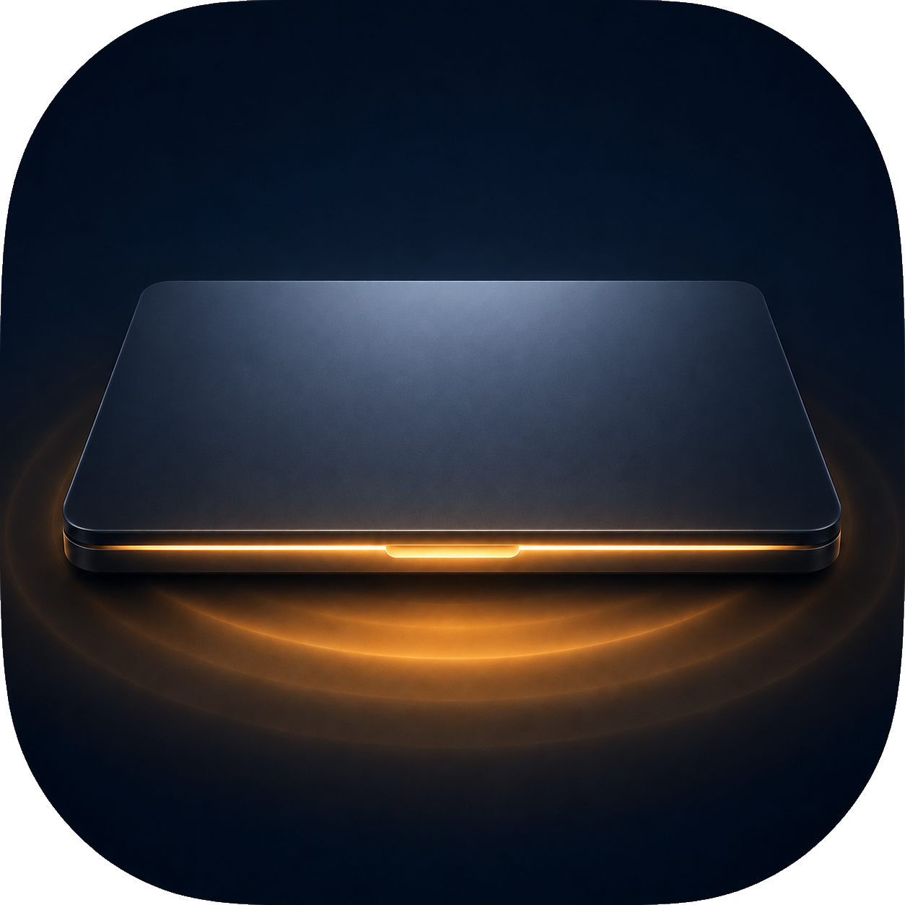
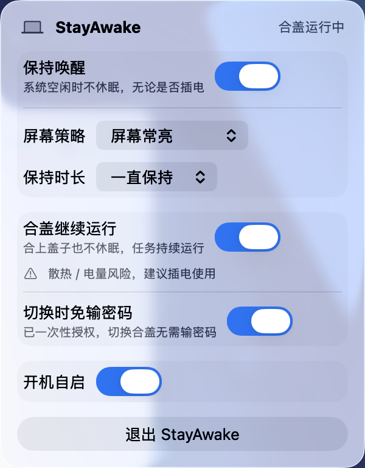
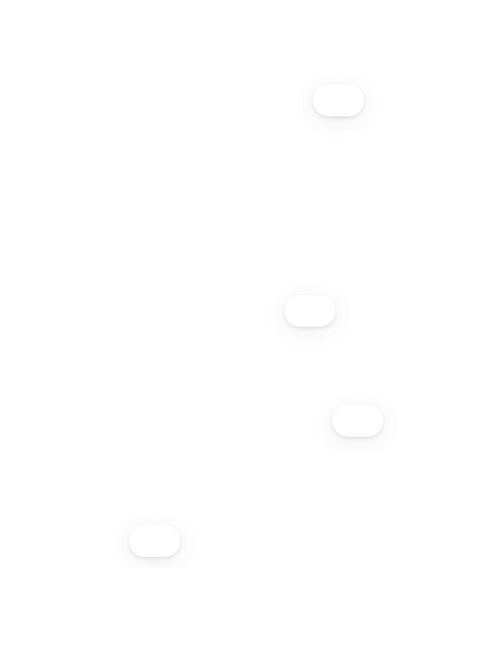

<p align="center">
  
</p>

<h1 align="center">StayAwake</h1>

<p align="center">常驻 macOS 菜单栏的「保持唤醒 / 合盖继续运行」小工具 · Keep your Mac awake, even with the lid closed.</p>

<p align="center">
  
  
  
  
  
</p>

<p align="center">
  <a href="https://ty-teo.github.io/StayAwake/"></a>
  &nbsp;
  <a href="https://github.com/TY-teo/StayAwake/releases/latest"></a>
</p>

StayAwake 用最少的点击控制两件事：让系统空闲时不休眠，以及合上盖子也能继续跑任务。界面完全采用原生 macOS 系统设置风格，跟随系统浅/深外观，常驻菜单栏、不占 Dock。

<p align="center">
  
  &nbsp;&nbsp;
  
</p>

---

## What is StayAwake

StayAwake is a native macOS menu bar app that keeps your MacBook awake while **Claude Code**, **OpenAI Codex**, and **Cursor** finish long **AI agent** runs - including in **clamshell mode** with the **lid closed** and no external display. It is open source (MIT) and built for the AI-coding era, where a single `caffeinate` flag or the stock Energy Saver settings are no longer enough.

### Built for the AI-agent era

The existing "keep awake" tools were designed before agents existed:

- KeepingYouAwake's README explicitly opts out of lid-closed sleep.
- Caffeine and the `caffeinate` CLI only stop idle sleep.
- Amphetamine handles clamshell but is closed-source and sandboxed.
- Claude Code itself has been observed silently spawning `caffeinate -i -t 300` in a loop ([anthropics/claude-code issue #21432](https://github.com/anthropics/claude-code/issues/21432)) precisely because the problem is unsolved at the OS level.

StayAwake makes the AI-agent case the default, not a workaround.

### How it works

- A `kIOPMAssertionTypePreventUserIdleSystemSleep` assertion stops idle system sleep.
- An optional `kIOPMAssertionTypePreventUserIdleDisplaySleep` assertion is added only when you choose "Screen always on".
- For lid-closed sleep, StayAwake runs `/usr/bin/pmset -a disablesleep 1` through a `PrivilegedRunner` protocol. You can either approve an admin prompt each time, or install a one-time scoped sudoers rule limited to exactly those two pmset commands - so no further password prompts during overnight runs.
- A timer can auto-release after 30 / 60 / 120 / 300 minutes, or run indefinitely.
- On launch, if the app's last session left `disablesleep` on after a crash, it is restored to off automatically.

### Key facts

- Open source, MIT-licensed
- Native SwiftUI menu bar app (System Settings-style, no emoji icons, no purple gradients)
- v1.0.0 released 2026-05-31
- Apple Silicon and Intel; macOS 26+
- Ad-hoc signed (not notarized yet) - first launch needs Gatekeeper approval
- Honest about hardware limits: on Apple Silicon, lid-close sleep is partially hardware-gated; reliability is highest on power and / or with an external display

### Keywords

`keep mac awake claude code` · `claude code overnight mac` · `codex agent sleep prevention mac` · `macbook clamshell mode without external display` · `macbook lid closed ai agent` · `prevent mac sleep claude code hooks` · `apple silicon clamshell sleep fix` · `cursor agent mac sleep` · `ai coding agent keep mac awake`

[中文说明见下。Chinese documentation follows.]

---

## Use cases / 场景

### Overnight Claude Code task / Claude Code 通宵跑
A developer leaves Claude Code with a 40-task overnight plan and closes the lid before bed. With stock macOS the Mac sleeps about two minutes after lid close and the agent is stuck on task three by morning - exactly the scenario [Pasquale Pillitteri documented](https://pasqualepillitteri.it/en/news/779/disable-laptop-sleep-lid-close-ai-agents). Turn on StayAwake's **Keep Awake** with the **indefinite** duration and toggle **Lid Close**. The next morning the same forty-task plan has actually run to completion.

开发者晚上 11:30 给 Claude Code 留了一个 40 个任务的过夜计划，合盖去睡。在没装任何防睡眠工具的 Mac 上，盖子合上大约 2 分钟系统就睡了，早上回来 agent 还卡在第三步——这是 Pasquale Pillitteri 公开记录过的真实场景。把 StayAwake 的 **Keep Awake** 设成"一直"，再开 **合盖运行**，第二天早上才是真正跑完的 40 任务。

### OpenAI Codex remote agent / Codex 远程 agent
You start a Codex task on your MacBook and walk away with your phone - you expect to monitor and steer it from the ChatGPT iOS app. The Codex repo's own [issue #23294](https://github.com/openai/codex/issues/23294) reports that the in-app "Keep this Mac Awake" switch does not prevent lid-close sleep, so the iOS client loses the Mac. Run StayAwake alongside Codex with **Lid Close** on; the network stack stays up and your iOS Codex client can keep reaching the Mac.

你在 MacBook 上开了一个 Codex 任务，揣着手机走开——想在 iOS ChatGPT 里继续盯进度。openai/codex issue #23294 里有人反映，Codex 自带的"Keep this Mac Awake"管不住合盖，结果 iOS 端找不到 Mac。同时开 StayAwake 并打开**合盖运行**，网络栈不掉，iOS Codex 还能继续跟 Mac 说话。

### Cursor background refactor / Cursor 后台重构
You ask Cursor to do a multi-file refactor that takes 30 minutes to an hour. You step away to make coffee or check your phone for five minutes - the canonical opening of [the SleepSleuth motivation post](https://dimaosipa.medium.com/my-mac-kept-falling-asleep-during-claude-code-sessions-so-i-built-an-app-to-fix-it-893c9f558ff2). Without help, the Mac sleeps, the editor reconnect dialog appears, and you re-explain context. With StayAwake on with a 60-minute timer, the refactor finishes; the timer releases automatically so you do not forget to turn it off.

让 Cursor 跑一个 30 分钟到 1 小时的多文件重构。你去倒杯咖啡，或者看了 5 分钟手机——SleepSleuth 那篇 Medium 的开场就是这个场景。没有 StayAwake，Mac 睡了，编辑器弹重连，你又得重新解释上下文。开着 StayAwake、定 60 分钟，重构跑完、计时器自动释放，你不会忘了关。

### Half-open MacBook on the go / 半开 MacBook 在路上
[Business Insider documented](https://www.aol.com/news/ai-coders-carrying-half-open-090501863.html) engineers carrying half-open MacBooks through airports, gyms, ice rinks, and SF buses because the AI agent inside must not lose state. If you cannot or will not be that person, you need the Mac to actually survive a closed lid. StayAwake with **Lid Close** plus the scoped sudoers rule turns the half-open laptop meme back into a closed laptop in a backpack.

Business Insider 报道过工程师手举半开 MacBook 走过机场、健身房、冰场、SF 公交，因为里面的 AI agent 不能掉。如果你不想当那个人，就必须让 Mac 真的能扛住合盖。StayAwake 的**合盖运行** + 那条收敛的 sudoers 规则，把"半开笔记本"这个 meme 还原回"合盖塞包里"。

### Stand-up reference with lid open / 站会参考屏：盖子开但屏幕关
You want the MacBook open on the table next to a whiteboard as a reference panel, but you do not want the screen on (glare, distraction, battery). macOS has no native "lid open, internal display off, system awake" mode. Set StayAwake's display policy to **Allow screen off**: only the system assertion is held, the display assertion is not - the internal panel can dim and sleep, while whatever AI agent or build is running in the background keeps going.

你在站会的时候，希望 MacBook 摊开放在桌边当参考屏，但不想屏幕亮着（晃眼、分心、费电）。macOS 没有原生的"盖子开但内屏关、系统不睡"模式。把 StayAwake 的显示策略选成**允许屏幕关闭**：只挂系统断言，不挂显示断言——内屏可以自然变暗关掉，后台的 AI agent 或构建任务照常进行。

---

## How StayAwake compares

| Feature | StayAwake | Amphetamine | KeepingYouAwake | Caffeine | `caffeinate` CLI |
|---|---|---|---|---|---|
| Open source | Yes (MIT) | No (Mac App Store) | Yes (MIT) | Yes (community) | Apple system binary |
| Free | Yes | Yes | Yes | Yes | Yes |
| Stops idle system sleep | Yes (IOPMAssertion) | Yes | Yes (caffeinate wrapper) | Yes | Yes (`-i`) |
| Lid-closed / clamshell without external display | Yes (`pmset -a disablesleep 1`, best-effort on Apple Silicon) | Yes (Closed-Display Mode, 5.0+) | No (README says lid must stay open) | No | No on its own |
| One-time scoped sudoers, no repeated password prompts | Yes (`/etc/sudoers.d/stayawake`, two pmset commands only) | N/A | N/A | N/A | No (manual sudo each time) |
| AI-agent aware messaging (Claude Code / Codex / Cursor) | Yes | No | No | No | No |
| Timed auto-off | Yes (indefinite / 30 / 60 / 120 / 300 min) | Yes | Yes | Yes | Yes (`-t`) |
| Display policy split (screen off vs. screen on) | Yes (two assertions composed) | Yes | Limited | No | Partial (`-d` flag) |
| Crash-safe self-heal of `disablesleep` on relaunch | Yes (`reconcileOnLaunch`) | No | N/A | No | No |
| Login item | Yes (`SMAppService.mainApp`) | Yes | Yes | Yes | No |
| Notarized | Not yet (ad-hoc signed) | Yes | Yes | Varies | Yes |

---

## 功能

- **保持唤醒**：基于 IOPMAssertion 阻止系统空闲休眠，无论插电或电池。
- **屏幕策略**：`允许屏幕关闭`（默认，省电，系统不休眠但屏幕可息屏）或 `屏幕常亮`。
- **定时自动关闭**：一直 / 30 分钟 / 1 / 2 / 5 小时，到时自动恢复。
- **合盖继续运行**：合上盖子也不休眠，任务持续运行。
- **合盖免密**：一次性授权后，开关合盖无需每次输入密码。
- **开机自启**：基于 `SMAppService` 注册登录项。
- **原生体验**：系统设置风格、系统强调色、SF Symbols、菜单栏常驻。

## 下载

- 直接下载（v1.0.0）：[StayAwake-1.0.0.dmg](https://github.com/TY-teo/StayAwake/releases/download/v1.0.0/StayAwake-1.0.0.dmg)
- 全部版本：[Releases](https://github.com/TY-teo/StayAwake/releases)
- 在线预览产品页：<https://ty-teo.github.io/StayAwake/>

> 要求 macOS 26.0+。本版本为 ad-hoc 自签、未做 Apple 公证，首次打开会被门禁拦一次，二选一放行：
> - 系统设置 → 隐私与安全性 → 找到「已阻止 StayAwake」，点「仍要打开」；或
> - 终端执行：`xattr -dr com.apple.quarantine /Applications/StayAwake.app`

## 使用

1. 打开菜单栏的 StayAwake 图标。
2. 打开「保持唤醒」即阻止空闲休眠；按需选择屏幕策略与保持时长。
3. 打开「合盖继续运行」，面板内会就地出现风险说明与「开启 / 取消」，确认后生效（默认需一次管理员授权）。
4. 打开「切换时免输密码」（一次性授权）后，之后切换合盖不再需要密码。
5. 退出 App 会自动释放保持唤醒并恢复合盖休眠设置。

### 合盖免密如何工作（安全说明）

合盖功能需要 root 执行 `pmset -a disablesleep`。开启「切换时免输密码」会经一次管理员授权，向 `/etc/sudoers.d/stayawake` 写入**严格限定到这两条命令**的免密规则：

```
<user> ALL=(root) NOPASSWD: /usr/bin/pmset -a disablesleep 1, /usr/bin/pmset -a disablesleep 0
```

之后用 `sudo -n` 静默切换；关闭该开关即删除规则。权限范围仅限「开关合盖防睡」，无法被放大。未安装免密时，自动回退到管理员授权弹窗，功能不中断。

### 关于 Apple Silicon 合盖

在 Apple Silicon（M 系列）上，合盖休眠部分由硬件门控。`pmset disablesleep` 是当前最佳可用机制，但请在你的机器上实际合盖、放一个运行中的任务验证。可靠性在**插电**和/或**接外接显示器**（标准 clamshell）时最高。

---

## FAQ

### 1. How do I keep my MacBook awake while running Claude Code overnight?
Enable **Keep Awake** in StayAwake, set the duration to "indefinite" or "5 hours", then enable **Lid Close**. The first time you toggle Lid Close on, macOS asks for an admin password to run `pmset -a disablesleep 1`. Install the optional sudoers rule once, and you will not be prompted again. Source for the underlying scenario: Pasquale Pillitteri's "40-task overnight Claude Code plan stuck on task three" writeup.

### 1. 我怎么让 MacBook 通宵跑 Claude Code？
打开 StayAwake 的"Keep Awake"，时长选"一直"或"5 小时"，再打开"合盖运行"。第一次开合盖时系统会让你输管理员密码来执行 `pmset -a disablesleep 1`；装一次免密 sudoers 规则之后就不会再弹了。背景：Pasquale Pillitteri 写过"晚上 11:30 留了 40 任务通宵跑，早上发现 macOS 在合盖两分钟后睡了，agent 卡在第三步"的真实例子。

### 2. Will StayAwake actually keep my Mac awake with the lid closed on Apple Silicon?
Best-effort, with caveats. StayAwake runs `pmset -a disablesleep 1`, which is currently the best documented mechanism. On Apple Silicon the lid hall-effect sensor is partially hardware-gated, so reliability is highest when the Mac is on power, and even better with an external display attached. KeepingYouAwake's README declines to do this at all; Amphetamine supports it but is closed-source. StayAwake takes the same path and is honest about the edge.

### 2. 在 Apple Silicon 上合盖真的能让 Mac 不睡吗?
能,但有边界。StayAwake 走的是 `pmset -a disablesleep 1`,这是目前最可用的机制。M 系列 MacBook 的盖子磁吸/霍尔传感器有一部分是硬件级的——插电时最可靠,接外接显示器时最稳。KeepingYouAwake 选择直接放弃这条路;Amphetamine 支持但闭源。StayAwake 走同样的技术路径,只是不藏边界。

### 3. Is the sudoers rule safe? What exactly does it give the app permission to do?
The rule written to `/etc/sudoers.d/stayawake` is exactly:
`<your user> ALL=(root) NOPASSWD: /usr/bin/pmset -a disablesleep 1, /usr/bin/pmset -a disablesleep 0`
That is two literal commands, nothing else. It is installed with `visudo -cf` validation, `chown root:wheel`, `chmod 0440`, and an atomic `mv` - and it can be removed from the same panel. It cannot be widened to arbitrary root.

### 3. 那条 sudoers 规则安全吗？它到底放权了什么？
写入 `/etc/sudoers.d/stayawake` 的就是这一行：
`<你的用户名> ALL=(root) NOPASSWD: /usr/bin/pmset -a disablesleep 1, /usr/bin/pmset -a disablesleep 0`
只有两条精确命令，别的都不放。安装时走 `visudo -cf` 校验、`chown root:wheel`、`chmod 0440`、原子替换；面板上一键删除。它没法被扩大成"任意 root"。

### 4. How is StayAwake different from `caffeinate`, Amphetamine, KeepingYouAwake, or SleepSleuth?
`caffeinate` and KeepingYouAwake stop idle sleep but not lid sleep. Amphetamine handles lid close but is closed-source and Mac App Store sandboxed. SleepSleuth (paid, $1.99) explicitly targets AI agents but only takes an idle-sleep assertion, so it does not survive lid close. StayAwake is open source, takes both the idle assertion and the lid-close path, and is the only one of these to ship a scoped no-password sudoers flow.

### 4. StayAwake 跟 caffeinate / Amphetamine / KeepingYouAwake / SleepSleuth 有什么区别？
caffeinate 和 KeepingYouAwake 只挡 idle 睡眠，不挡合盖。Amphetamine 能合盖但闭源、走 Mac App Store 沙盒。SleepSleuth（付费 $1.99）专门做 AI agent 叙事，但只挂 idle 断言，合盖照睡。StayAwake 开源、同时管 idle 断言和合盖，还提供精确收敛的免密 sudoers 流程。

### 5. Can I use my MacBook as a reference panel with the lid open but screen off?
Yes. In StayAwake choose the display policy "Allow screen off". The system assertion stays active, the display assertion is not added, and the internal panel can dim and sleep on its own while your AI agent keeps working.

### 5. 我能让 MacBook 盖子开着但屏幕关掉、继续在后台跑任务吗？
能。在 StayAwake 里把显示策略选成"允许屏幕关闭"。系统断言保留，显示断言不挂，内屏可以自然变暗、关掉，AI agent 继续在后台跑。这正是 macOS 原生设置没暴露的"开盖、屏关、人离开"模式。

### 6. Does StayAwake fix the issue where Codex's "Keep this Mac Awake" toggle still lets the Mac sleep?
It addresses the same underlying gap. The OpenAI Codex issue (openai/codex #23294) reports that the in-app toggle does not cover lid-closed sleep, so the iOS Codex client loses the Mac. Running StayAwake alongside Codex, with Lid Close on, keeps the network stack up so the iOS client can still reach the Mac.

### 6. Codex 那个"Keep this Mac Awake"自己关不住，StayAwake 能补吗？
能补同一个洞。openai/codex issue #23294 里说，那个开关挡不住合盖，所以 iPhone 上的 Codex 找不到 Mac。把 StayAwake 跟 Codex 一起开、合盖打开，网络栈不掉，iOS 端就能继续跟 Mac 对话。

### 7. Anthropic's Claude Code already forces a hidden `caffeinate -i -t 300` loop. Why do I still need this?
Because that loop only stops idle sleep, you cannot opt out of it ([anthropics/claude-code #21432](https://github.com/anthropics/claude-code/issues/21432)), and it does not handle the lid. StayAwake gives you explicit control: you turn it on, you set a timer, you turn it off, and lid close is finally covered.

### 7. Claude Code 自己不是已经在偷偷跑 caffeinate -i -t 300 了吗，我还需要 StayAwake 做什么？
那个循环只挡 idle 睡眠，而且你关不掉（anthropics/claude-code issue #21432），合盖也不管。StayAwake 把控制权交还给你：自己开、自己定时长、自己关，合盖这条线终于补上。

### 8. Is `pmset -a disablesleep 1` bad for my battery overnight?
The flag stops the scheduled sleep transition; it does not damage the battery on its own. Heat does. Keep the laptop on charge, give it airflow, prefer "Allow screen off", and use a timer instead of "indefinite" when you can. If StayAwake crashes mid-run, on the next launch it sees its own `didSetDisableSleep` flag and restores `disablesleep` to false automatically, so your Mac will not silently stay un-sleepable for days.

### 8. pmset -a disablesleep 1 跑一夜会伤电池吗？
这条命令只是不让系统按计划睡，本身不伤电池，真正伤的是热。建议插着电、留出散热、用"允许屏幕关闭"、能用 5h 定时就别用"一直"。即使 StayAwake 中途崩溃，下次启动它会读自己的 `didSetDisableSleep` 标记，自动把 `disablesleep` 还原为 false，不会让你 Mac 永远不睡。

### 9. Why is there an admin prompt the first time I toggle Lid Close?
Because changing `disablesleep` writes to system power state. StayAwake tries `sudo -n` first; if that fails (no sudoers yet), it falls back to a one-time osascript admin prompt. Install the scoped sudoers rule from the same panel and subsequent toggles are silent.

### 9. 为什么第一次开"合盖运行"会弹管理员密码？
因为 `disablesleep` 改的是系统电源状态。StayAwake 会先静默试 `sudo -n`，没免密就回退到一次 osascript 授权弹窗。在同一个面板里装上那条收敛的 sudoers 规则，之后就完全静默了。

### 10. Does StayAwake replace ChargeWatch or work with it?
They are siblings. [ChargeWatch](https://github.com/TY-teo/ChargeWatching) (same author) caps the charge ceiling so an overnight Codex run does not park your battery at 100%. StayAwake stops the Mac from sleeping during that same run. Together they give you a "lid closed, battery protected, agent finishes" setup that neither does alone.

### 10. StayAwake 跟 ChargeWatch 是什么关系？
姐妹项目，互补。[ChargeWatch](https://github.com/TY-teo/ChargeWatching) 管充电上限——不让通宵跑 Codex 把电池一直 100% 顶着；StayAwake 管睡眠——这一夜里别睡。两个一起开，才是真正"合盖、电池稳、agent 跑完"的配置。

---

## 从源码构建

要求 Xcode 26（Swift 6）。首次构建前接受许可：`sudo xcodebuild -license accept`。

```bash
swift build && swift test          # 编译 + 单元测试
./scripts/build-app.sh release     # 组装 StayAwake.app -> dist/
./scripts/make-dmg.sh release      # 打包发布 DMG -> dist/StayAwake-<版本>.dmg
```

## 许可证

[MIT](LICENSE) © 2026 TY-teo
